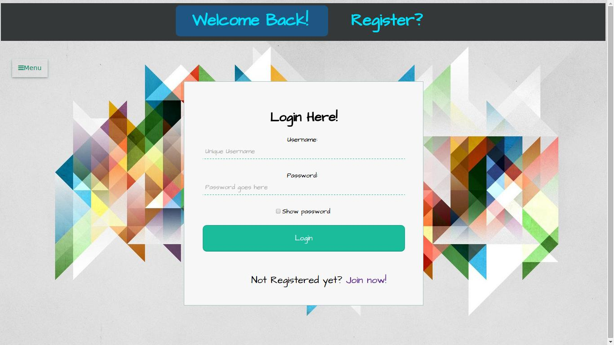

# Quiz Away
Here's a samll quizzing portal where to put it simply, users can add (and by extension edit and delete) questions and answer questions published by others. There's a leaderboard and a couple of extras to make this (more) fun.

###What I used
1. Client Side
  1. HTML (with the [phpti](http://arshaw.com/phpti/) templating engine)
  2. CSS
  3. Javascript/JQuery
2. Server Side
  1. PHP+MySQL (LAMP)

###Server Routes
- Open to all
    - `/`, `/home` (A simple homepage)
    -  `/login` (The login page)
    -  `/register` (The registration page)
    -  `/leaderboard` (The leaderboard)
    -  `/user` (A page to choose which user profile to view)
    -  `/user/{username}` (View {username}'s profile)
- Protected (Only logged in users)
    - `/submit` (View, edit or delete previously submitted questions or add new ones)
    - `/quiz` (Answer all questions put up by other users)
    - `/quiz/{category}`(Questions pertaining to {category})

###Build Instructions
1. Clone the repo onto a subdirectory of your base apache server directory.
2. Theres a .htaccess file for neat routes. To enable it, 
    - LAMP: Open the terminal and
        1. `sudo nano /etc/apache2/sites-available/default`
        2. Once inside that file, find the following section, and change the line that says AllowOverride from None to All. The section should now look like this:
                `<Directory /var/www/>
                Options Indexes FollowSymLinks MultiViews
                AllowOverride All
                Order allow,deny
                allow from all
                </Directory>`
        3. Save the file and restart apache.  `sudo service apache2 restart`
    - WAMP: Check out this [stackoverflow answer](http://stackoverflow.com/a/20840834)
3. Edit the config.php file. Write in your Username, Password and DBName.
  - The database schema is given in the [Database.sql](Database.sql) file.
  - 

3. Just open index.php and play around

###Links to Download additional software
1. Server     
    1. [Here's](https://www.digitalocean.com/community/tutorials/how-to-install-linux-apache-mysql-php-lamp-stack-on-ubuntu) a guide on installing the LAMP stack. Explained with much more clarity and patience than I can muster.
2. External modules
    1. The [table sorter Jquery Plugin](https://github.com/christianbach/tablesorter). A simple client side tool to make tables sortable.
    2. The [highcharts Jquery plugin](https://github.com/highchartTable/jquery-highchartTable-plugin). A jquery plugin to make the use of [Highcharts](www.highcharts.com), an interactive javascript chart generating library, easier.
    3. The [phpti](http://arshaw.com/phpti/) templating engine that helps make reusable templates vary easily 

###Screenshots
1. 
2. 
3. 
4. 
5.  
6.  
